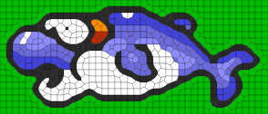

# pixelArtVectorizer
Vectorize Pixel Arts in Go
Convert pixel art to SVG vector image

Based on my previous project SVG Vectorize in .net framework https://github.com/michaelrbk/pixelart-vectorizer

The old version was a proof of concept and the creation of the core algorithm. This new version in go lang has the goal to create a console app to convert a pixel art to a new image file vectorized. With several improvements aiming at make the algorithm usable in other applications, maybe even an emulator.


* Representation of the source file
<p style="text-align:center">

</p>

* Generating a graph with similar color
<p style="text-align:center">

</p>

* Solving ambiguities in the graph's connections 
<p style="text-align:center">

</p>

* Reshaping the pixel
<p style="text-align:center">

</p>


**Tests and Code Coverage**
```
go test -cover -coverprofile=/testData/cover
go tool cover -html="./testData/cover" -o "./testData/coverage.html"
```
Copyright [2020] [Michael de Rezende Becker]

Licensed under the Apache License, Version 2.0 (the "License"); you may not use this file except in compliance with the License. You may obtain a copy of the License at

http://www.apache.org/licenses/LICENSE-2.0
Unless required by applicable law or agreed to in writing, software distributed under the License is distributed on an "AS IS" BASIS, WITHOUT WARRANTIES OR CONDITIONS OF ANY KIND, either express or implied. See the License for the specific language governing permissions and limitations under the License.
